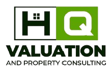

# HQ Valuation and Property Consulting

<div align="center">
  
  
  ### Professional Property Valuation & Consulting Services in Ghana
  
  [](https://hqproperty.com)
  [](https://ghis.org.gh)
  [](https://wa.me/qr/RLY3X3MONSJ2P1)
</div>

---

## 🏢 About HQ Valuation and Property Consulting

HQ Valuation and Property Consulting is a professional property advisory firm registered with the Registrar General's Department of Ghana and licensed by the **Ghana Institute of Surveyors (GhIS)**. We provide comprehensive property services including valuation, asset management, brokerage, and legal advisory services.

### 🎯 Our Mission

Empowering property owners, investors, and businesses with accurate valuations and strategic insights that drive confident decision-making in Ghana's dynamic real estate market.

### 🔭 Our Vision

To be Ghana's leading property valuation and consulting firm, recognized for setting the standard in professional excellence, market insight, and client-centered service delivery.

### 💎 Core Values

- **Integrity** - Honest, reliable, ethical, and trustworthy
- **Excellence** - Superior technical solutions and services
- **Teamwork** - Connected professionals with vision, knowledge, and experience

---

## 🛠️ Services Offered

| Service                       | Description                                                                  |
| ----------------------------- | ---------------------------------------------------------------------------- |
| **Valuation**                 | Precise property valuations for buying, selling, financing, and tax purposes |
| **General Property Advisory** | Expert guidance through every stage of the property lifecycle                |
| **Asset Management**          | Customized strategies to enhance asset value and optimize performance        |
| **Brokerage**                 | Seamless transactions connecting buyers and sellers                          |
| **Legal Advisory**            | Essential legal support in property law and compliance                       |
| **Land & Property Agency**    | Property acquisition, sales, and leasing services                            |

---

## 📊 Our Track Record

- **46+** Happy Clients
- **13** Industrial Properties Valued
- **14** Residential Properties Valued
- **24** Commercial Properties Valued

---

## 🤝 Trusted By

We've had the privilege of working with leading organizations including:

<div align="center">
  
  
  
  
  
  
</div>

---

## 🌐 Website Features

This is a single-page static website built with:

- **Bootstrap 5.3.3** - Responsive framework
- **AOS (Animate On Scroll)** - Smooth animations
- **Swiper** - Hero carousel
- **GLightbox** - Image galleries
- **Isotope** - Portfolio filtering
- **PureCounter** - Animated statistics

### Key Sections

1. **Hero** - Dynamic carousel showcasing services
2. **About** - Company mission, vision, and values
3. **Stats** - Project statistics and achievements
4. **Portfolio** - Client logos and partnerships
5. **Services** - Detailed service offerings
6. **Why Us** - Core values and differentiators
7. **Team** - Professional team members
8. **FAQ** - Common questions answered
9. **Contact** - Get in touch with us

---

## 🚀 Quick Start

### Prerequisites

- Any static web server (Python, PHP, Node.js, or Live Server)
- Modern web browser

### Running Locally

**Using Python:**

```bash
python -m http.server 8000
```

**Using PHP:**

```bash
php -S localhost:8000
```

**Using VS Code:**

- Install Live Server extension
- Right-click `index.html` → Open with Live Server

Then visit: `http://localhost:8000`

---

## 📂 Project Structure

```
hqproperty/
├── index.html              # Main HTML file
├── assets/
│   ├── css/
│   │   └── main.css       # Custom styles (1863 lines)
│   ├── js/
│   │   └── main.js        # Custom JavaScript (265 lines)
│   ├── img/               # Images and logos
│   │   ├── clients/       # Client logos
│   │   ├── team/          # Team photos
│   │   └── portfolio/     # Portfolio images
│   └── vendor/            # Third-party libraries
│       ├── bootstrap/
│       ├── aos/
│       ├── swiper/
│       └── glightbox/
└── forms/                 # PHP form handlers
    ├── contact.php
    └── newsletter.php
```

---

## 🎨 Design System

### Color Palette

```css
--accent-color: #5c9f24      /* Brand Green */
--background-color: #ffffff   /* White */
--heading-color: #2a2a2a     /* Dark Gray */
--default-color: #444444     /* Medium Gray */
```

### Typography

- **Default Font**: Roboto
- **Heading Font**: Playfair Display
- **Navigation Font**: Merriweather

---

## 📞 Contact Information

**Address:**  
P.O Box ABK 215  
Abeka Lapaz, Accra, Ghana

**Phone:**  
+233 24 304 6067  
+233 50 134 5685

**Email:**  
Hqvaluationandpropertyservices@gmail.com

**WhatsApp:**  
[Click to Chat](https://wa.me/qr/RLY3X3MONSJ2P1)

---

## 📄 License

This website uses the BootstrapMade "Groovin" template.  
Template License: [BootstrapMade License](https://bootstrapmade.com/license/)

---

## 🤝 Contributing

For website improvements or bug reports, please contact the development team.

---

## 🙏 Acknowledgments

- **Template**: BootstrapMade - Groovin
- **Bootstrap**: v5.3.3
- **Icons**: Bootstrap Icons
- **Animations**: AOS Library

---

<div align="center">
  <p><strong>HQ Valuation and Property Consulting</strong></p>
  <p>Your Trusted Partner in Property Excellence</p>
  <p>© 2024 HQ Valuation and Property Consulting. All Rights Reserved.</p>
  
  [](https://linkedin.com)
  [](mailto:info@hqvaluation.com)
</div>
